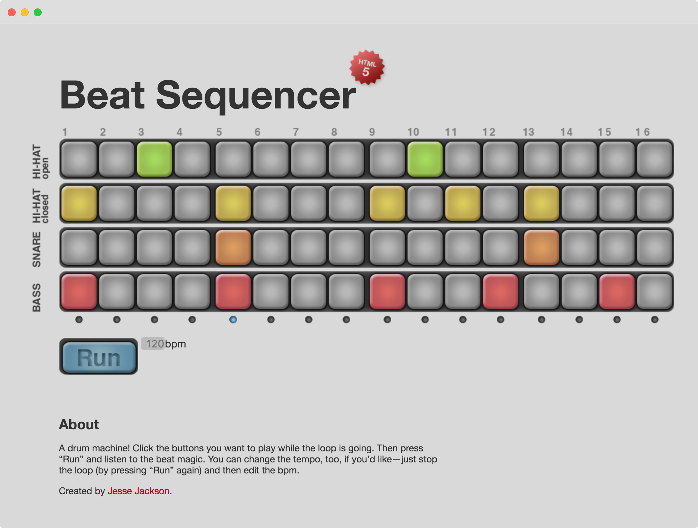

# beat-sequencer-html5

My first JS project (I made it in 2010 when html5 audio was hot stuff). It's just a simple drum machine written in JS and HTML5. I was tasked with creating a "digital version of a physical machine" in a web design class where we were being taught PHP. I asked the course instructor if I could write mine in JS instead and he said ok. Lucky me, considering where the web has gone since then.

Demo [here](https://jsejcksn.github.io/beat-sequencer-html5/)
